<div align="center">


<h1>Zero Trust Reference Model</h1>

<p><strong>The Strategic Foundation for Enterprise Zero Trust Formal Modeling, Layered Security Interactions, and Policy Frameworks.</strong></p>

[]()
[]()
[]()

<br/>

> **"A security model is the mathematical heart of Zero Trust."** 
> **Zero Trust Reference Model** is an enterprise-grade platform designed to provide a secure, measurable, and highly automated foundation for global security formalization. It orchestrates the complex lifecycle of Zero Trust modeling—from layered architecture definitions and identity models to automated policy frameworks and incident response models.

</div>

---

## 🏛️ Executive Summary

Conceptual ambiguity and fragmented security models are strategic operational liabilities; lack of a formalized reference model is a primary barrier to mature Zero Trust adoption. Organizations fail to model their security not because of a lack of documentation, but because of fragmented modeling standards, lack of automated logic validation, and an inability to evaluate cross-layer trust with operational precision.

This platform provides the **Security Model Intelligence Plane**. It implements a complete **Enterprise Model-as-Code Framework**, enabling Security Architects and Research teams to manage the formal zero-trust model as a first-class citizen. By automating the verification of trust interactions and orchestrating real-time model-driven policies, we ensure that every organizational interaction—from API calls to data access—is modeled for security by default, audited for consistency, and strictly aligned with institutional formal logic.

---

## 📐 Architecture Storytelling: Principal Reference Models

### 1. Principal Architecture: Global Zero Trust Reference Model & Formal Logic Plane
This diagram illustrates the end-to-end flow from formal model definition and layered interaction modeling to trust verification, policy enforcement, and institutional model auditing.

```mermaid
graph LR
    %% Subgraph Definitions
    subgraph FormalModeling["Formal Logic & Definition"]
        direction TB
        IdentityModel["Identity Interaction Model"]
        NetworkModel["Micro-Segmentation Logic"]
        DataModel["Data Sensitivity Flow"]
    end

    subgraph IntelligenceEngine["Model Intelligence Hub"]
        direction TB
        API["FastAPI Model Gateway"]
        PDP["Policy Decision Engine"]
        Validator["Formal Verification Service"]
        Aggregator["Risk & Trust Aggregator"]
    end

    subgraph InteractionPlane["Layered Trust Interactions"]
        direction TB
        DeviceLayer["Device Health & Posture"]
        AppLayer["Application Access Flow"]
        InfraLayer["Infrastructure Isolation"]
    end

    subgraph OperationsHub["Institutional Model Hub"]
        direction TB
        Scorecard["Model Maturity Scorecard"]
        Analytics["Interaction Risk Analytics"]
        Audit["Forensic Model Metadata Lake"]
    end

    subgraph DevOps["Model-as-Code Orchestration"]
        direction TB
        TF["Terraform Model Modules"]
        OPA["Policy-as-Code (Rego) Hub"]
        AuditSvc["Continuous Model Audit"]
    end

    %% Flow Arrows
    FormalModeling -->|1. Define Formalism| API
    API -->|2. Aggregate Signals| Aggregator
    Aggregator -->|3. Request Decision| PDP
    PDP -->|4. Verify Logic| Validator
    
    Validator -->|5. Enforce at Device| DeviceLayer
    DeviceLayer -->|6. Authorize App| AppLayer
    AppLayer -->|7. Secure Infra| InfraLayer
    
    API -->|8. Visualize Health| Scorecard
    Scorecard -->|9. Track Anomalies| Analytics
    Scorecard -->|10. Record Result| Audit
    
    TF -->|11. Provision Hub| IntelligenceEngine
    OPA -->|12. Load Formal Logic| PDP
    Audit -->|13. Improve Formalism| FormalModeling

    %% Styling
    classDef formal fill:#f5f5f5,stroke:#616161,stroke-width:2px;
    classDef intel fill:#e1f5fe,stroke:#01579b,stroke-width:2px;
    classDef interactions fill:#ede7f6,stroke:#311b92,stroke-width:2px;
    classDef ops fill:#e0f2f1,stroke:#004d40,stroke-width:2px;
    classDef devops fill:#fffde7,stroke:#f57f17,stroke-width:2px;

    class FormalModeling formal;
    class IntelligenceEngine intel;
    class InteractionPlane interactions;
    class OperationsHub ops;
    class DevOps devops;
```

### 2. The Model Lifecycle Flow
The continuous path of a security model from initial definition and formalization to active verification, application, monitoring, and institutional optimization.

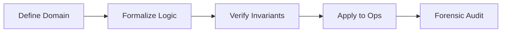

### 3. Layered Trust Verification Model
Executing cryptographically bound verification across the application, network, and device layers to ensure that trust is never assumed and always recalculated.

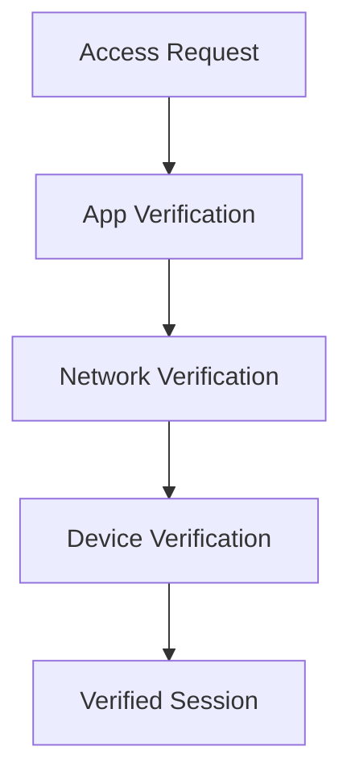

### 4. Policy Decision (PDP) Formal Logic Flow
Orchestrating the high-performance evaluation of access requests against mathematical trust models using standardized logic frameworks like Rego/OPA.

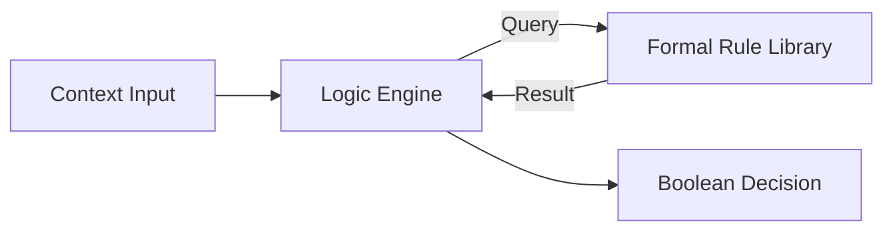

### 5. Multi-Dimensional Risk Aggregation Hub
Merging diverse security signals—including identity status, environment context, and behavioral anomalies—into a single, high-fidelity trust score.

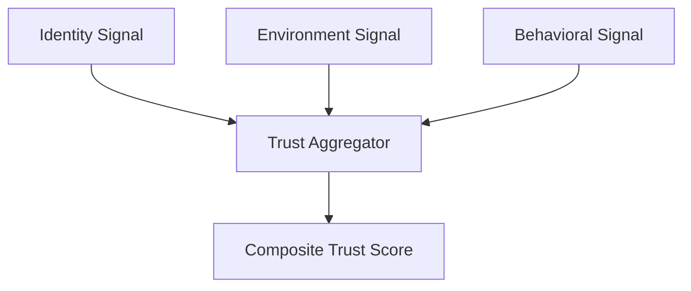

### 6. Secure Flow Invariant Monitoring Architecture
Continuously monitoring active traffic and access patterns for deviations from the formal reference model to identify potential breaches or misconfigurations.

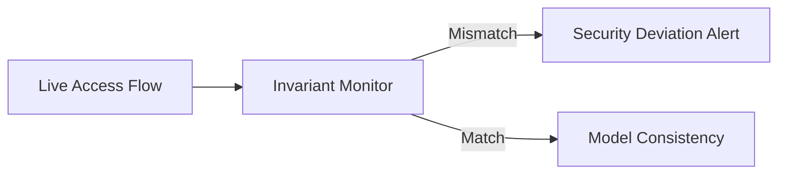

### 7. Data Residency & Sovereign Trust Model
Formally modeling trust and data flow requirements across geopolitical and sovereign boundaries to ensure compliance with global data residency regulations.

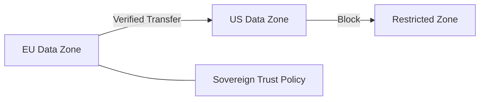

### 8. Institutional Zero Trust Model Scorecard
Grading organizational security performance based on key indicators: Model Coverage, Logic Consistency, and Mean Time to Violation Detection.

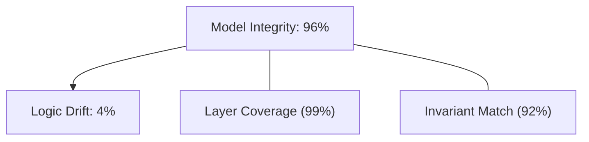

### 9. Identity & RBAC for Model Governance
Managing fine-grained access to formal logic libraries, trust scoring thresholds, and model logs between Security Scientists, Architects, and Leads.

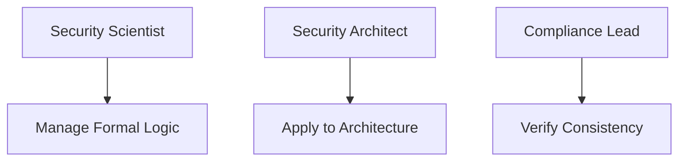

### 10. IaC Deployment: Model-as-Code Framework
Using Terraform to deploy and manage the versioned distribution of the formal logic hubs, verification workers, and forensic model lakes.

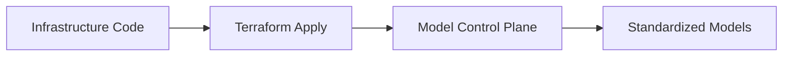

### 11. Metadata Lake for Forensic Model Audit
Storing long-term records of every model change, verification decision, and trust score calculation for institutional record-keeping and audit.

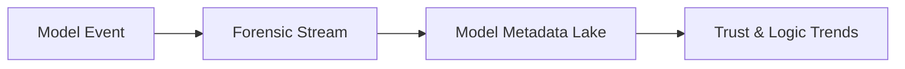

---

## 🏛️ Core Modeling Pillars

1.  **Formal Logic Foundation**: Defining security requirements as verifiable, mathematical invariants.
2.  **Layered Interaction Modeling**: Standardizing how identity, network, and device layers interact under zero trust.
3.  **Adaptive Trust Aggregation**: Dynamically calculating risk based on multi-dimensional real-time signals.
4.  **Invariant Flow Monitoring**: Continuous verification of live system behavior against the formal model.
5.  **Sovereign Trust Mapping**: Modeling data and identity flows across geopolitical and regulatory boundaries.
6.  **Full Model Auditability**: Immutable recording of every model change and verification event for institutional forensics.

---

## 🛠️ Technical Stack & Implementation

### Model Engine & APIs
*   **Framework**: Python 3.11+ / FastAPI.
*   **Formal Verification Core**: Integration with OPA/Rego for high-performance logic evaluation.
*   **Risk Orchestrator**: Custom engine for aggregating and weighting cross-layer security signals.
*   **Interaction Monitor**: Intelligent engine for comparing live telemetry against model invariants.
*   **State Management**: PostgreSQL (Metadata Lake) and Redis (Model State Cache).

### Model Dashboard (UI)
*   **Framework**: React 18 / Vite.
*   **Theme**: Emerald, Teal, Slate (Modern scientific & security aesthetic).
*   **Visualization**: Recharts for logic consistency trends, trust distribution, and model maturity.

### Infrastructure & DevOps
*   **Runtime**: AWS EKS or Azure Kubernetes Service (AKS).
*   **Governance**: Policy-as-Code enforcement for all infrastructure and access requests.
*   **IaC**: Modular Terraform for deploying the formal model hub and verification distributions.

---

## 🏗️ IaC Mapping (Module Structure)

| Module | Purpose | Real Services |
| :--- | :--- | :--- |
| **`infrastructure/model_hub`** | Central management plane | EKS, PostgreSQL, Redis |
| **`infrastructure/logic`** | Formal Rule Libraries | OPA, Rego, Git |
| **`infrastructure/verification`** | Trust Verification Workers | Lambda, EventBridge |
| **`infrastructure/auditing`** | Forensic model sinks | S3, Athena, Quicksight |

---

## 🚀 Deployment Guide

### Local Principal Environment
```bash
# Clone the model platform
git clone https://github.com/devopstrio/zero-trust-reference-model.git
cd zero-trust-reference-model

# Configure environment
cp .env.example .env

# Launch the Model stack
make init

# Trigger a mock formal verification and trust-scoring simulation
make simulate-model
```

Access the Model Dashboard at `http://localhost:3000`.

---

## 📜 License
Distributed under the MIT License. See `LICENSE` for more information.

---
<div align="center">
  <p>© 2026 Devopstrio. All rights reserved.</p>
</div>
