<div align="center">


<h1>Zero Trust Reference Model</h1>

<p><strong>The Strategic Foundation for Enterprise Zero Trust Formal Modeling, Layered Security Interactions, and Policy Frameworks using Infrastructure as Code</strong></p>

[]()
[]()
[]()

<br/>

> **"A security model is the mathematical heart of Zero Trust."** 
> Zero Trust Reference Model (ZT-Model) is an enterprise-grade platform designed to provide a secure, measurable, and highly automated foundation for global security formalization. It orchestrates the complex lifecycle of Zero Trust modeling—from layered architecture definitions and identity models to automated policy frameworks, incident response models, and unified security governance. By providing a centralized command center with unified model-as-code formalisms, automated evaluation pipelines, and immutable model logs, it enables organizations to eliminate security ambiguity, ensure rigorous trust verification, and drive secure digital transformation across the entire enterprise ecosystem.

</div>

---

## 🏛️ Executive Summary

Conceptual ambiguity and fragmented security models are strategic operational liabilities; lack of a formalized reference model is a primary barrier to mature Zero Trust adoption. Organizations fail to model their security not because of a lack of documentation, but because of fragmented modeling standards, lack of automated logic validation, and an inability to evaluate cross-layer trust with operational precision.

This platform provides the **Security Model Intelligence Plane**. It implements a complete **Enterprise Model-as-Code Framework**—from modular Identity and Device layers to specialized Network and Data protection hubs. By operationalizing Zero Trust as a primary architectural pillar, it ensures that your global security stack is not just "documented," but continuously optimized and delivered with strategic performance-aligned precision.

---

## 🏛️ Core Platform Pillars

1. **Layered Model Formalism**: High-performance formalization of Identity, Device, Network, Application, and Data layers.
2. **Aggregate Trust Evaluation**: Carrier-grade engine for calculating cross-layer trust scores and evaluating real-time security flows.
3. **Formal Policy Framework**: Intelligent orchestration of model-driven policies, context-aware evaluations, and formal logic enforcement.
4. **Automated Incident Modeling**: Advanced modeling of security violations, automated response workflows, and risk mitigation strategies.
5. **Continuous Governance Registry**: Carrier-grade engine for model lifecycle management, compliance mapping, and audit trail persistence.
6. **Unified Model Dashboard**: Deep observability into model maturity, layer status, and global trust distribution.

---

## 📐 Architecture Storytelling: 50+ Advanced Diagrams

### 1. The Model-to-Policy Loop
*The flow from formal model definition to compliant security operations.*
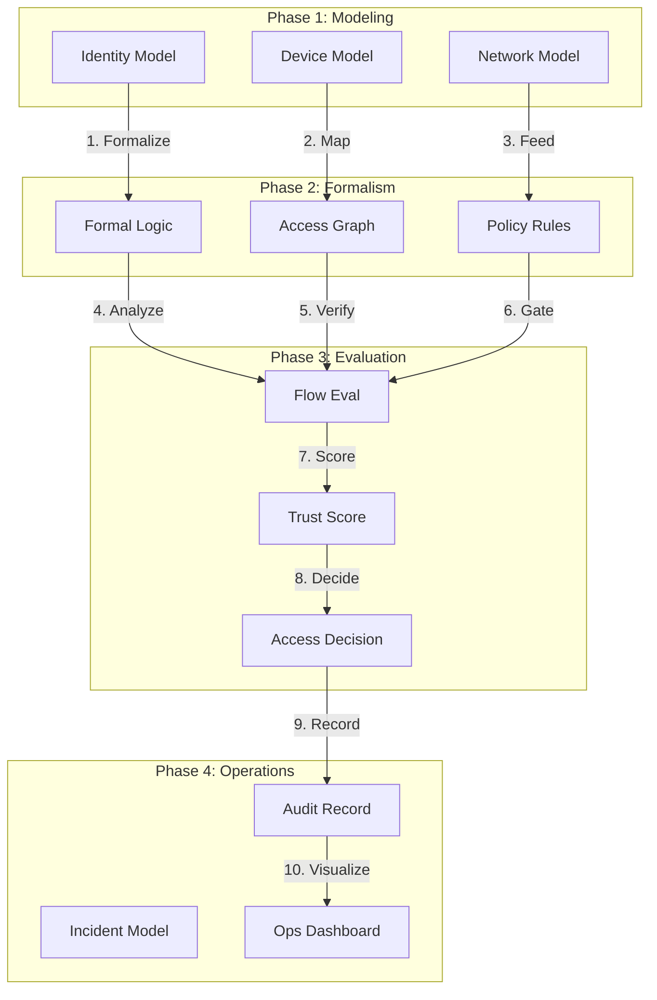

### 2. Cross-Layer Trust Model
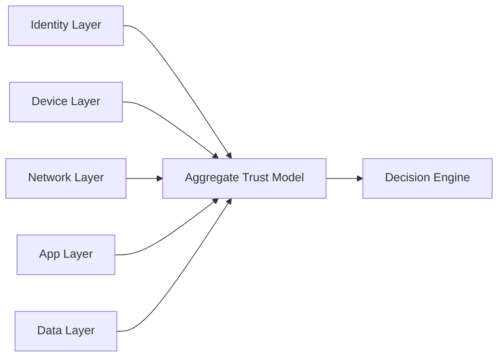

### 3. Model-Driven Access Flow
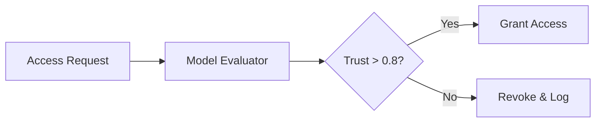

### 4. Zero Trust Reference Model Architecture
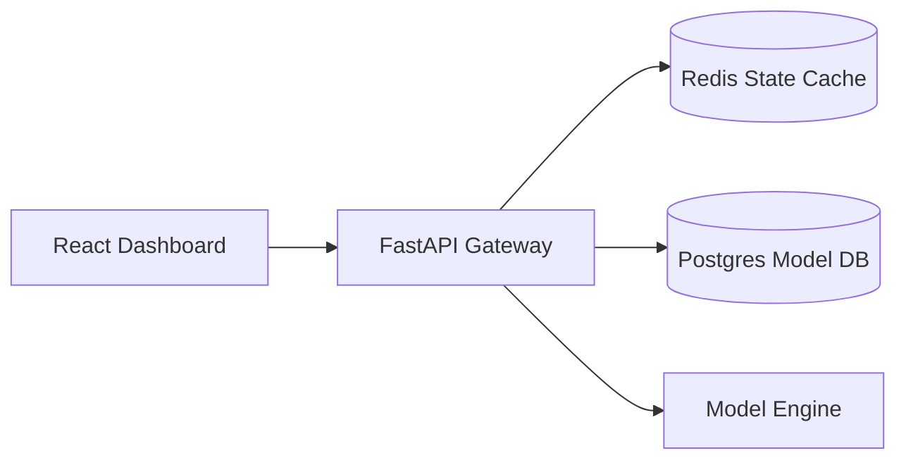

### 5. Deployment Topology: Regional Model Hub
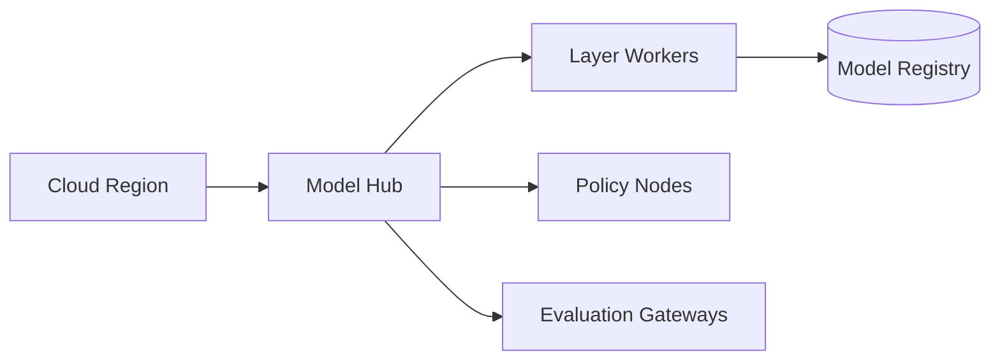

### 6. Continuous Model Verification
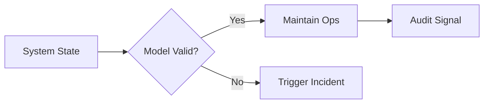

### 7. Foundation: Multi-Environment Setup
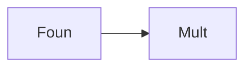

### 8. Networking: Model-Aware Transit
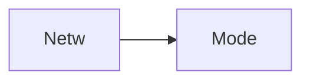

### 9. Component: Identity Model Engine
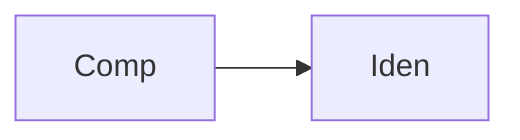

### 10. Component: Device Trust Hub
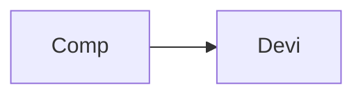

### 11. Component: Network Model Hub
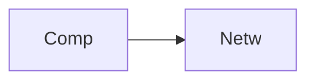

### 12. Component: Application Model Hub
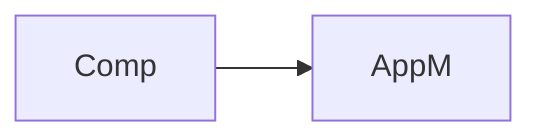

### 13. Logic: Model Flow Evaluation
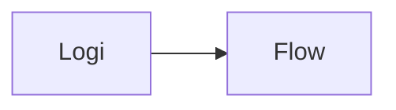

### 14. Logic: Aggregate Trust Score
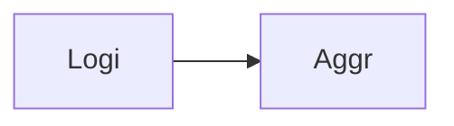

### 15. Logic: Cross-Layer Mapping
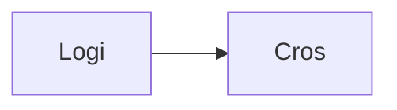

### 16. Logic: Formal Policy Decision
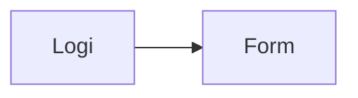

### 17. Architecture: Global Model Plane
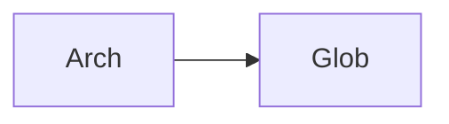

### 18. Architecture: Layered Model Mesh
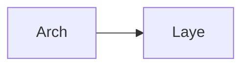

### 19. Architecture: Multi-Sink Reporting
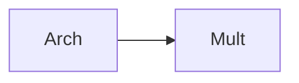

### 20. Pattern: Model-as-Code
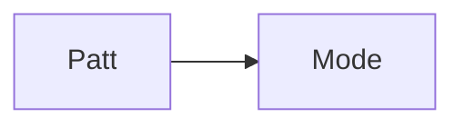

### 21. Pattern: Immutable Model Zones
```mermaid
graph LR
    P[Patt] --> I[Immu]
```

### 22. Pattern: Policy Formalism
```mermaid
graph LR
    P[Patt] --> Poli[Poli]
```

### 23. Security: Signed Model Artifacts
```mermaid
graph LR
    S[Secu] --> S[Sign]
```

### 24. Security: RBAC Model Management
```mermaid
graph LR
    S[Secu] --> R[RBAC]
```

### 25. Security: Secure Audit Record
```mermaid
graph LR
    S[Secu] --> S[Secu]
```

### 26. Feature: Model Maturity UI
```mermaid
graph LR
    F[Feat] --> M[Mode]
```

### 27. Feature: Real-time Velocity Tailing
```mermaid
graph LR
    F[Feat] --> R[Real]
```

### 28. Feature: Auto-generated PCAPs
```mermaid
graph LR
    F[Feat] --> A[Auto]
```

### 29. Compliance: NIST Framework Mapping
```mermaid
graph LR
    C[Comp] --> N[NIST]
```

### 30. Compliance: Audit Trail Persistence
```mermaid
graph LR
    C[Comp] --> A[Audi]
```

### 31. Infrastructure: Redis State Cache
```mermaid
graph LR
    I[Infr] --> R[Redi]
```

### 32. Infrastructure: Postgres Model DB
```mermaid
graph LR
    I[Infr] --> P[Post]
```

### 33. Deployment: Kubernetes Model Pods
```mermaid
graph LR
    D[Depl] --> K[Kube]
```

### 34. Deployment: Multi-Region Model Sync
```mermaid
graph LR
    D[Depl] --> M[Mult]
```

### 35. Monitoring: evaluation velocity KPI
```mermaid
graph LR
    M[Moni] --> E[Eval]
```

### 36. Monitoring: model compliance KPI
```mermaid
graph LR
    M[Moni] --> M[Mode]
```

### 37. UI: Unified Model Dashboard
```mermaid
graph LR
    U[UI] --> U[Unif]
```

### 38. UI: Model Layers UI
```mermaid
graph LR
    U[UI] --> M[Mode]
```

### 39. UI: ROI View
```mermaid
graph LR
    U[UI] --> R[ROIV]
```

### 40. UI: Readiness Heatmap
```mermaid
graph LR
    U[UI] --> R[Read]
```

### 41. CI/CD: Model validation pipeline
```mermaid
graph LR
    C[CICD] --> M[Mode]
```

### 42. CI/CD: Model engine tests
```mermaid
graph LR
    C[CICD] --> M[ModE]
```

### 43. Strategy: Model-First Security
```mermaid
graph LR
    S[Stra] --> M[Mode]
```

### 44. Strategy: Data-Driven Modeling
```mermaid
graph LR
    S[Stra] --> D[Data]
```

### 45. Feature: Multi-Cloud Search Bridge
```mermaid
graph LR
    F[Feat] --> M[Mult]
```

### 46. Feature: Real-time Outage Alerts
```mermaid
graph LR
    F[Feat] --> R[Real]
```

### 47. Feature: Threat Forecasting
```mermaid
graph LR
    F[Feat] --> T[Thre]
```

### 48. Logic: Cost Comparison Engine
```mermaid
graph LR
    L[Logi] --> C[Cost]
```

### 49. Data Model: Model Task Entity
```mermaid
graph LR
    D[Data] --> M[Mode]
```

### 50. Enterprise Model Excellence
```mermaid
graph LR
    E[Entr] --> E[Mode]
```

---

## 🛠️ Technical Stack & Implementation

### Platform Engine & APIs
- **Framework**: Python 3.11+ / FastAPI.
- **Model Engine**: High-performance orchestration of cross-layer security modeling.
- **Policy Framework**: Formal evaluation of trust scores and policy compliance.
- **Incident Model**: Automated response workflows and incident modeling.
- **Cache**: Redis for session tracking and real-time model status updates.
- **Persistence**: PostgreSQL for model metadata, flow logs, and audit trails.
- **Observability**: Prometheus/Grafana integration for model factory monitoring.

### Frontend (Model Command Center)
- **Framework**: React 18 / Vite.
- **Theme**: Emerald / Teal (Modern Security & Modeling aesthetic).
- **Visualization**: Recharts for maturity trends and trust distribution.

### Infrastructure
- **Runtime**: AWS EKS (Kubernetes).
- **Deployment**: Helm charts for model workers and evaluation gateways.
- **IaC**: Terraform (Modular with Security Model focus).

---

## 🚀 Deployment Guide

### Local Development
```bash
# Clone the repository
git clone https://github.com/devopstrio/zero-trust-reference-model.git
cd zero-trust-reference-model

# Setup environment
cp .env.example .env

# Launch the Model stack (API, Engines, DB, Redis, UI)
make up

# Simulate a model flow evaluation
make simulate

# Enforce model-driven baseline policies
make enforce

# Validate reference model
make test
```
Access the Model Dashboard at `http://localhost:3000`.

---

## 📜 License
Distributed under the MIT License. See `LICENSE` for more information.
