<div align="center">


<h1>Zero Trust Reference Model</h1>

<p><strong>The Strategic Foundation for Enterprise Zero Trust Formal Modeling, Layered Security Interactions, and Policy Frameworks using Infrastructure as Code</strong></p>

[]()
[]()
[]()

<br/>

> **"A security model is the mathematical heart of Zero Trust."** 
> Zero Trust Reference Model (ZT-Model) is an enterprise-grade platform designed to provide a secure, measurable, and highly automated foundation for global security formalization. It orchestrates the complex lifecycle of Zero Trust modeling—from layered architecture definitions and identity models to automated policy frameworks, incident response models, and unified security governance. By providing a centralized command center with unified model-as-code formalisms, automated evaluation pipelines, and immutable model logs, it enables organizations to eliminate security ambiguity, ensure rigorous trust verification, and drive secure digital transformation across the entire enterprise ecosystem.

</div>

---

## 🏛️ Executive Summary

Conceptual ambiguity and fragmented security models are strategic operational liabilities; lack of a formalized reference model is a primary barrier to mature Zero Trust adoption. Organizations fail to model their security not because of a lack of documentation, but because of fragmented modeling standards, lack of automated logic validation, and an inability to evaluate cross-layer trust with operational precision.

This platform provides the **Security Model Intelligence Plane**. It implements a complete **Enterprise Model-as-Code Framework**—from modular Identity and Device layers to specialized Network and Data protection hubs. By operationalizing Zero Trust as a primary architectural pillar, it ensures that your global security stack is not just "documented," but continuously optimized and delivered with strategic performance-aligned precision.

---

## 🏛️ Core Platform Pillars

1. **Layered Model Formalism**: High-performance formalization of Identity, Device, Network, Application, and Data layers.
2. **Aggregate Trust Evaluation**: Carrier-grade engine for calculating cross-layer trust scores and evaluating real-time security flows.
3. **Formal Policy Framework**: Intelligent orchestration of model-driven policies, context-aware evaluations, and formal logic enforcement.
4. **Automated Incident Modeling**: Advanced modeling of security violations, automated response workflows, and risk mitigation strategies.
5. **Continuous Governance Registry**: Carrier-grade engine for model lifecycle management, compliance mapping, and audit trail persistence.
6. **Unified Model Dashboard**: Deep observability into model maturity, layer status, and global trust distribution.

---

## 📐 Architecture Storytelling: 12 Advanced Enterprise Diagrams

These high-level reference architectures represent enterprise-grade solutions designed for CTO-level presentations, demonstrating end-to-end data flows, strict security boundaries, and integration points across modern hybrid and multi-cloud environments.

### 1. Enterprise Cloud Landing Zone (Hub & Spoke)
*Business Purpose: Establishes a scalable, secure, and well-governed foundation for enterprise cloud workloads with centralized network inspection and identity management.*
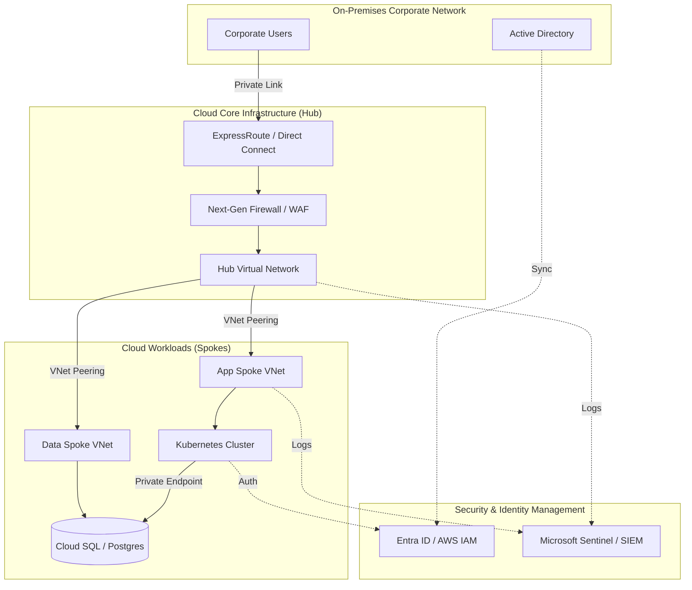

### 2. Zero Trust Security Architecture
*Business Purpose: Implements a "never trust, always verify" model, enforcing continuous authentication, contextual access policies, and micro-segmentation across the enterprise.*
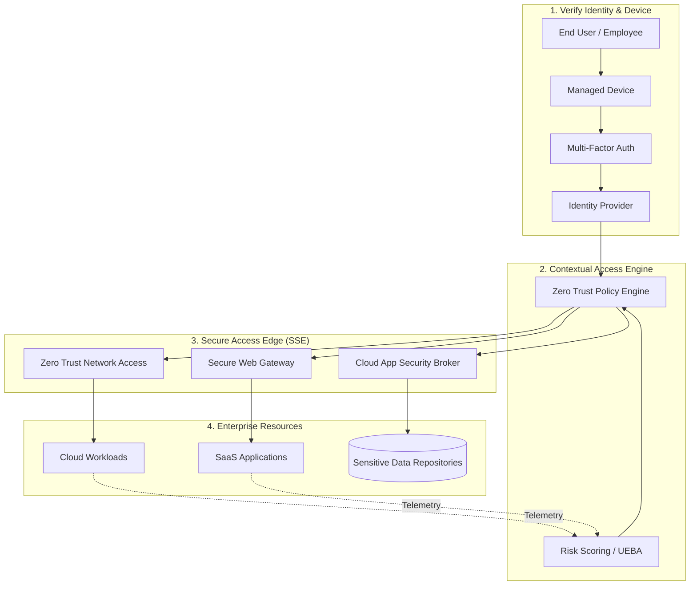

### 3. Generative AI & ML Enterprise Platform
*Business Purpose: Provides a secure, scalable platform for building and deploying Large Language Models (LLMs) over enterprise data while protecting intellectual property.*
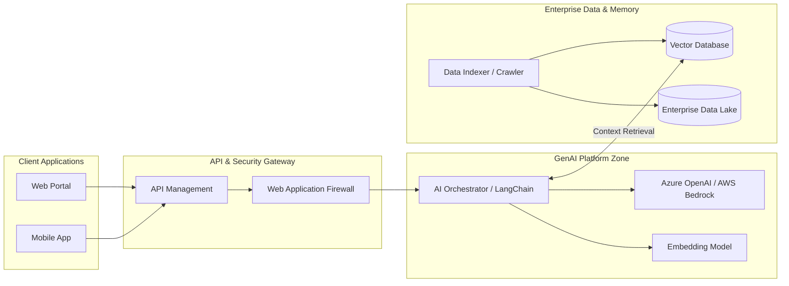

### 4. DevSecOps & GitOps Pipeline
*Business Purpose: Automates software delivery through a secure supply chain, embedding security scanning at every stage and enforcing infrastructure-as-code deployments.*
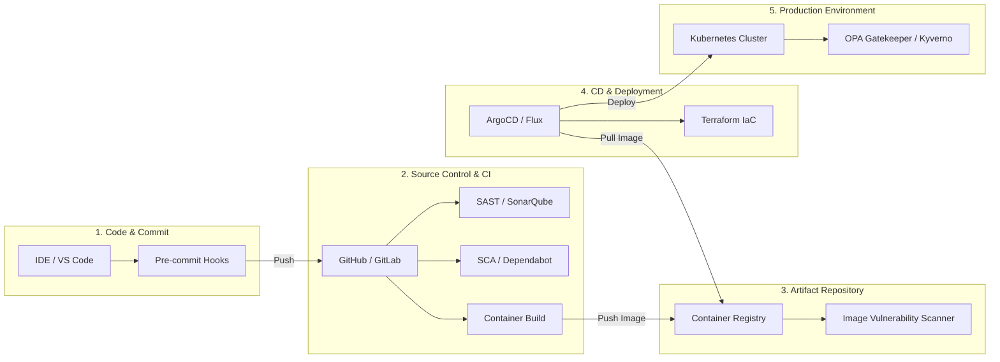

### 5. Enterprise Data Platform (Mesh & Lakehouse)
*Business Purpose: Democratizes data access by ingesting multi-modal sources into a governed Lakehouse, enabling advanced analytics, BI, and real-time event processing.*
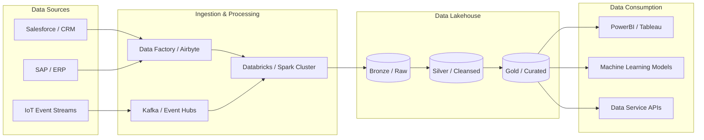

### 6. Enterprise Kubernetes (AKS/EKS) Platform
*Business Purpose: Standardizes containerized workload orchestration with embedded security mesh, ingress routing, and native cloud-service integrations.*
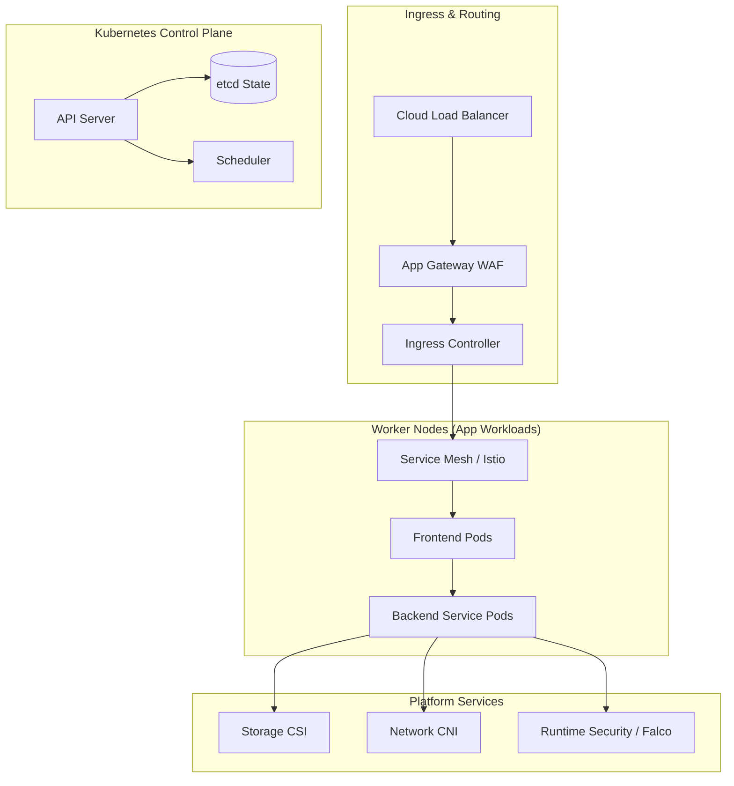

### 7. Global Hub & Spoke Networking Architecture
*Business Purpose: Connects global regions and on-premises datacenters via a highly available transit backbone, enforcing centralized firewalling and routing policies.*
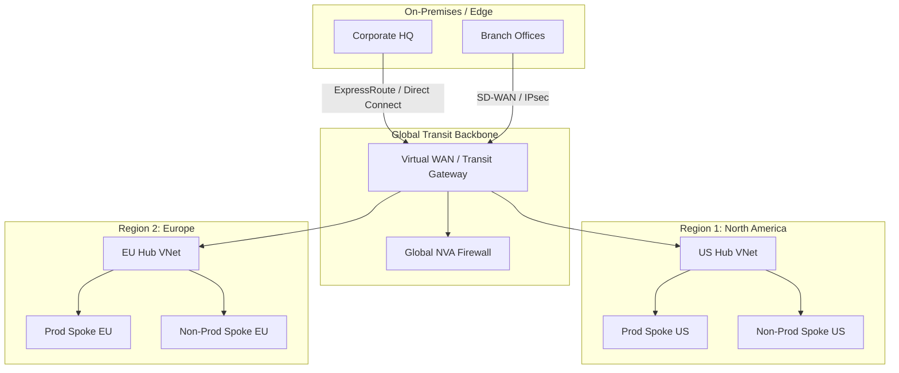

### 8. Identity & Access Management (IAM) Broker
*Business Purpose: Centralizes identity governance, enabling SSO, federated access, and conditional policies for employees, partners, and customers across all apps.*
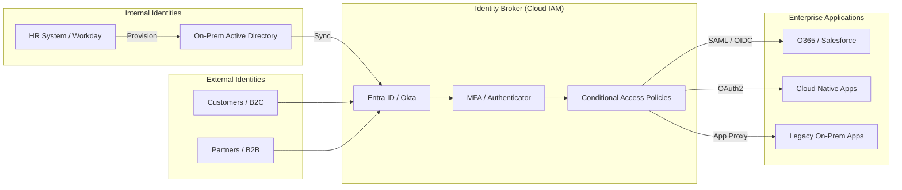

### 9. Cloud Observability & Monitoring Platform
*Business Purpose: Provides unified visibility into infrastructure, network, and application health, accelerating incident response through centralized logging and tracing.*
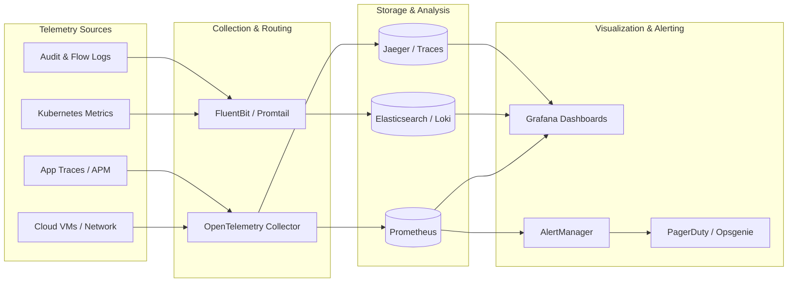

### 10. Multi-Cloud Resiliency & Active-Active BCDR
*Business Purpose: Ensures business continuity and disaster recovery by distributing traffic across multiple cloud providers, utilizing asynchronous data replication.*
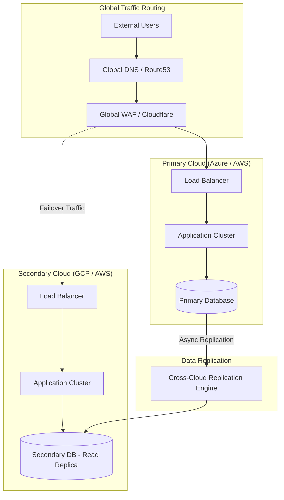

### 11. Event-Driven Microservices Architecture
*Business Purpose: Decouples domain services for independent scalability, using an asynchronous message bus to handle high-throughput, real-time event processing.*
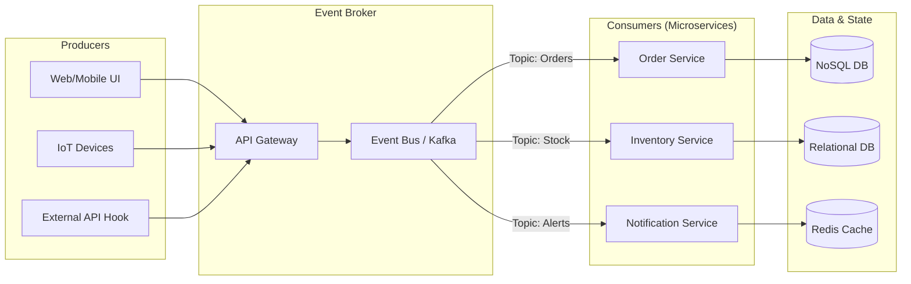

### 12. Secure Application Delivery & Edge Processing
*Business Purpose: Protects public-facing applications from DDoS attacks and exploits at the edge, while optimizing content delivery through caching and bot mitigation.*
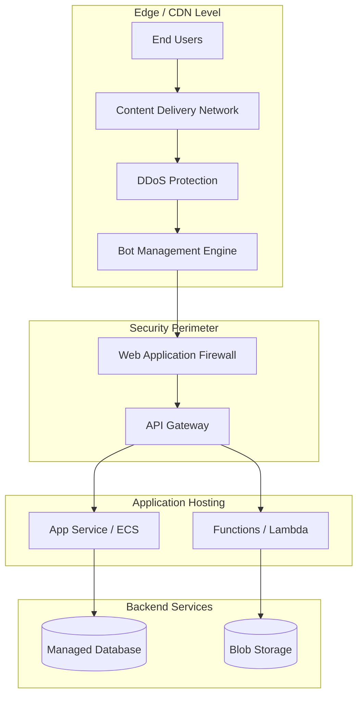

---

## 🛠️ Technical Stack & Implementation

### Platform Engine & APIs
- **Framework**: Python 3.11+ / FastAPI.
- **Model Engine**: High-performance orchestration of cross-layer security modeling.
- **Policy Framework**: Formal evaluation of trust scores and policy compliance.
- **Incident Model**: Automated response workflows and incident modeling.
- **Cache**: Redis for session tracking and real-time model status updates.
- **Persistence**: PostgreSQL for model metadata, flow logs, and audit trails.
- **Observability**: Prometheus/Grafana integration for model factory monitoring.

### Frontend (Model Command Center)
- **Framework**: React 18 / Vite.
- **Theme**: Emerald / Teal (Modern Security & Modeling aesthetic).
- **Visualization**: Recharts for maturity trends and trust distribution.

### Infrastructure
- **Runtime**: AWS EKS (Kubernetes).
- **Deployment**: Helm charts for model workers and evaluation gateways.
- **IaC**: Terraform (Modular with Security Model focus).

---

## 🚀 Deployment Guide

### Local Development
```bash
# Clone the repository
git clone https://github.com/devopstrio/zero-trust-reference-model.git
cd zero-trust-reference-model

# Setup environment
cp .env.example .env

# Launch the Model stack (API, Engines, DB, Redis, UI)
make up

# Simulate a model flow evaluation
make simulate

# Enforce model-driven baseline policies
make enforce

# Validate reference model
make test
```
Access the Model Dashboard at `http://localhost:3000`.

---

## 📜 License
Distributed under the MIT License. See `LICENSE` for more information.
